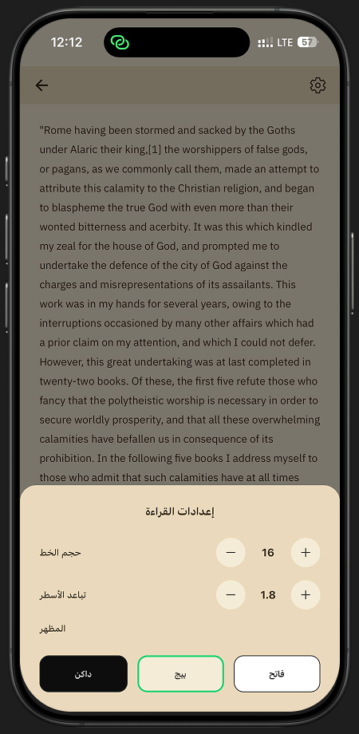
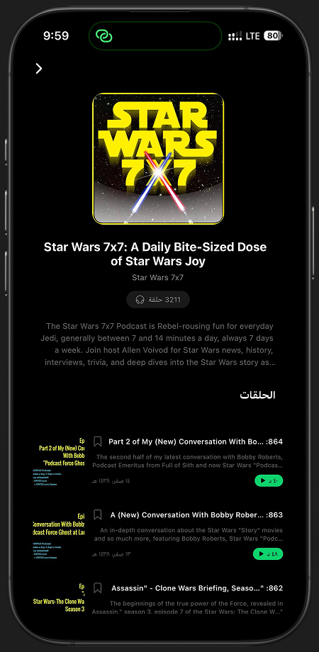
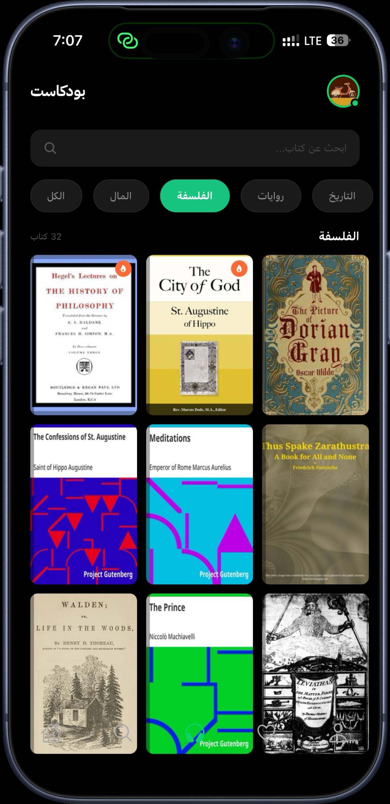
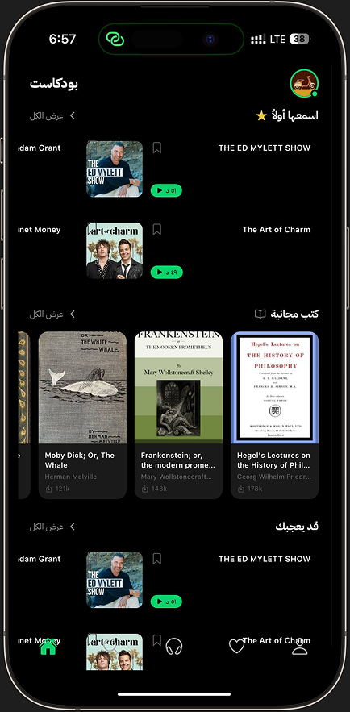
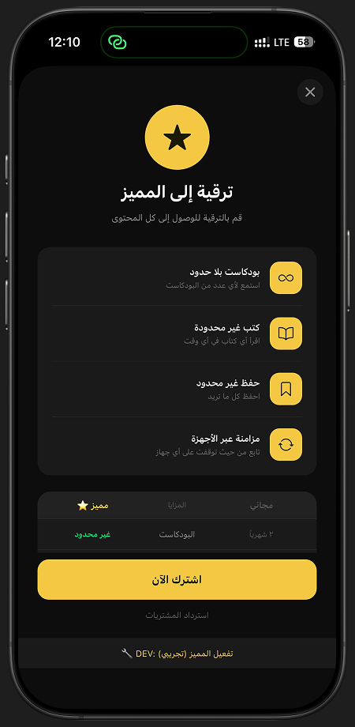

<div align="center">

# 🎙️ بودكاست — ourpodcast

**A premium Arabic podcast & e-book reader app built with Expo & React Native**

[](https://expo.dev)
[](https://reactnative.dev)
[](https://typescriptlang.org)
[](https://supabase.io)
[](https://revenuecat.com)

</div>

---

## 📱 Screenshots

<div align="center">

| الرئيسية (Home Feed) | تفاصيل البودكاست (Podcast Detail) | مكتبة الكتب (Book Library) |
|:---:|:---:|:---:|
|  |  |  |

| قارئ الكتب مع الإعدادات (Book Reader + Settings) | شاشة الاشتراك المميز (Paywall) |
|:---:|:---:|
|  |  |

</div>

---

## 🌟 Overview

**ourpodcast** is a full-featured, Arabic-first mobile application that combines a **podcast player** and an **e-book reader** in one elegant dark-themed experience. It targets Arabic-speaking audiences with full RTL (right-to-left) support, a freemium subscription model, and a beautifully polished UI.

The app is built on **Expo SDK 54** with the **New Architecture** enabled, powered by **Supabase** for authentication and data, and **RevenueCat** for in-app purchases.

---

## ✨ Features

### 🏠 Home Feed
- **Continue Listening** — Picks up exactly where you left off with a persistent last-played episode card
- **"Hear It First" (اسمعها أولاً)** — Curated premium-exclusive episodes section
- **"You Might Like" (قد يعجبك)** — Personalised episode recommendations
- **Arabic Podcasts Section** — Dedicated Arabic-language podcast feed
- **Free Books Strip** — Quick horizontal preview of available free books
- Horizontally scrollable episode pairs for a compact, scannable layout

### 🎧 Podcast Player
- Full **audio playback** with `expo-av` — play, pause, resume
- **Seek bar** with real-time progress tracking
- **Skip forward / backward 15 seconds**
- **Playback speed control** — 1×, 1.5×, 2×
- **Mini Player** — a persistent bottom bar that keeps playback alive while navigating between tabs
- **Continue listening** state persisted via `AsyncStorage`
- Subscription gate — prompts free users when they hit their monthly podcast limit

### 📚 Book Library & Reader
- Searchable **book grid** with 3-column shelf layout
- **Category filter pills** — All / Finance / Philosophy / Novels / History
- Skeleton loading cards while content fetches
- Infinite scroll with automatic pagination
- "Popular" 🔥 badge for books with > 50 000 downloads
- **Full in-app reader** with paginated text
- **Reader settings panel:**
  - Font size control (12–28 pt)
  - Line height control (1.2–2.5)
  - Theme switcher: **Dark (داكن)** / **Sepia (بيج)** / **Light (فاتح)**
- Book detail page shows: cover, author, page count, download count, reading ease score, subjects, and summary
- Subscription gate for free-tier book limits

### 🔐 Authentication
- **Email & Password** sign-up and sign-in
- **Google OAuth** via `expo-web-browser` (in-app browser — no redirect loop)
- Email **verification** flow
- Supabase session persistence — stays logged in across restarts
- Authenticated routes automatically redirect unauthenticated users to the login screen

### 💎 Subscription & Monetization
- Powered by **RevenueCat** for cross-platform in-app purchases
- **Free tier limits (per month):**
  - 2 different podcasts (up to 2 episodes each)
  - 1 book
- **Premium (مميز) unlocks:**
  - Unlimited podcasts & episodes
  - Unlimited books
  - Unlimited saving
  - Cross-device sync
- **Paywall screen** with feature comparison table, live pricing from RevenueCat, and purchase/restore flows
- Usage tracked locally with `AsyncStorage`, resets automatically at the start of each new calendar month
- Real-time subscription status listener via RevenueCat

### 📌 Saved / Favourites
- Save any podcast episode or book with a single tap (`SaveButton` component)
- **Favourites tab** with toggle between saved podcasts and saved books
- Data stored in Supabase (`saved_podcasts` / `saved_books` tables)
- Refreshes on screen focus so changes are always up to date

### 🔍 Search
- Dedicated **Search tab** for discovering content
- Debounced live search with 500 ms delay to avoid excessive requests
- Category filter resets automatically when a search query is entered

### 👤 Profile
- Avatar, display name, and email
- Premium / Free badge
- Subscription upgrade banner for free users showing remaining monthly quota
- Account settings (edit profile, notifications, saved)
- App settings (language, appearance)
- Support links (help center, privacy policy)
- Free content usage history section
- Sign-out with confirmation dialog
- App version number

---

## 🏗️ Project Architecture

```
ourpodcast/
├── app/                          # Expo Router — file-based navigation
│   ├── _layout.tsx               # Root layout — AuthProvider + SubscriptionProvider + MiniPlayer
│   ├── index.tsx                 # Entry point / redirect logic
│   ├── global.css                # Global NativeWind / Tailwind styles
│   ├── (tabs)/                   # Bottom tab navigator
│   │   ├── _layout.tsx           # Tab bar configuration
│   │   ├── index.tsx             # 🏠 Home screen
│   │   ├── search.tsx            # 🔍 Search screen
│   │   ├── favorites.tsx         # 📌 Saved podcasts & books
│   │   ├── library.tsx           # 📚 Book library
│   │   └── profile.tsx           # 👤 Profile & settings
│   ├── (auth)/                   # Auth group (no tab bar)
│   │   ├── login.tsx             # Login — email + Google
│   │   ├── signup.tsx            # Sign-up
│   │   └── verify.tsx            # Email verification prompt
│   ├── Player.tsx                # 🎧 Full-screen audio player
│   ├── BookDetail.tsx            # 📖 Book detail + in-app reader
│   └── podcastdetail.tsx         # 🎙️ Podcast detail + episode list
│
├── components/                   # Reusable UI components
│   ├── BookCard.tsx              # Book card (large)
│   ├── Bookcardsmall.tsx         # Book card (small — horizontal strips)
│   ├── EpisodeRow.tsx            # Episode list row
│   ├── Header.tsx                # Screen header
│   ├── mainCardComponent.tsx     # Episode card with poster, title, duration
│   ├── MiniPlayer.tsx            # Persistent bottom mini-player bar
│   ├── PayWallScreen.tsx         # Subscription paywall modal
│   ├── RecentSections.tsx        # Recently played / viewed sections
│   ├── SavedButton.tsx           # Save / unsave toggle button
│   ├── Text.tsx                  # Styled text component (IBMPlex Arabic font)
│   └── onboardingSlide.tsx       # Onboarding slide component
│
├── context/
│   ├── AuthContext.tsx           # Auth state — sign-in / sign-up / sign-out / Google
│   └── Subscriptioncontext.tsx   # Premium status, usage tracking, free limits
│
├── hooks/                        # Custom data-fetching hooks
│   ├── useHome.ts                # Home feed (hearFirst, youMightLike)
│   ├── useArabicPodcast.ts       # Arabic podcast feed
│   ├── usePodcast.ts             # Generic podcast hook
│   ├── usePodcastDetail.ts       # Podcast detail + paginated episodes
│   ├── useBook.ts                # Book list — category + search + pagination
│   ├── useBookdetail.ts          # Book detail + paginated reader pages
│   ├── useSaerch.ts              # Search hook
│   ├── useSaved.ts               # Saved podcasts (Supabase)
│   ├── useSavedbooks.ts          # Saved books (Supabase)
│   ├── useRecent.ts              # Recently accessed content
│   ├── useContentgate.ts         # Content access gate (subscription check)
│   └── useRequireAuth.ts         # Auth guard hook
│
├── store/
│   └── useAudioStore.ts          # Zustand store — global audio playback state
│
├── services/
│   ├── books.ts                  # Book API + BOOK_CATEGORIES definitions
│   ├── podcastService.ts         # Podcast API service
│   └── supabaselibrary.ts        # Supabase save / unsave helpers
│
├── lib/
│   ├── supabase.ts               # Supabase client initialisation
│   └── revenuecat.ts             # RevenueCat — setup, purchase, restore
│
├── utils/
│   └── scripthtml.ts             # HTML script utility helpers
│
└── assets/
    ├── fonts/                    # IBM Plex Sans Arabic (Regular, Medium, Bold)
    ├── onboardingImages/         # Onboarding artwork
    ├── home-feed.png             # Screenshot — home feed
    ├── podcast-detail.png        # Screenshot — podcast detail
    ├── book-library.png          # Screenshot — book library
    ├── reader-settings.png       # Screenshot — book reader + settings panel
    └── paywall.png               # Screenshot — paywall
```

---

## 🛠️ Tech Stack

| Category | Technology |
|---|---|
| **Framework** | [Expo SDK 54](https://expo.dev) (New Architecture enabled) |
| **Language** | TypeScript 5.9 |
| **Navigation** | [Expo Router 6](https://expo.github.io/router) — file-based |
| **UI Styling** | [NativeWind 4](https://nativewind.dev) + React Native StyleSheet |
| **State Management** | [Zustand 5](https://zustand-demo.pmnd.rs) |
| **Audio Playback** | [expo-av](https://docs.expo.dev/versions/v54.0.0/sdk/av/) |
| **Backend / Auth** | [Supabase](https://supabase.io) |
| **In-App Purchases** | [RevenueCat](https://revenuecat.com) (`react-native-purchases`) |
| **Typography** | IBM Plex Sans Arabic — Regular / Medium / Bold |
| **Animations** | [Reanimated 4](https://docs.swmansion.com/react-native-reanimated/) |
| **Gestures** | React Native Gesture Handler |
| **Images** | [expo-image](https://docs.expo.dev/versions/v54.0.0/sdk/image/) |
| **Local Storage** | AsyncStorage |
| **Icons** | [@expo/vector-icons](https://docs.expo.dev/guides/icons/) (Ionicons) |
| **Haptics** | expo-haptics |
| **Gradients** | expo-linear-gradient |

---

## 🚀 Getting Started

### Prerequisites

- [Node.js](https://nodejs.org) ≥ 18
- [Expo CLI](https://docs.expo.dev/get-started/installation/) — `npm install -g expo-cli`
- iOS Simulator (macOS) or Android Emulator / physical device
- A [Supabase](https://supabase.io) project with the required tables (see schema below)
- A [RevenueCat](https://revenuecat.com) account with a monthly subscription product configured

### Installation

```bash
# 1. Clone the repository
git clone https://github.com/3mer77/ourpodcast.git
cd ourpodcast

# 2. Install dependencies
npm install
```

### Environment Variables

Create a `.env` file in the project root:

```env
EXPO_PUBLIC_SUPABASE_URL=https://your-project.supabase.co
EXPO_PUBLIC_SUPABASE_ANON_KEY=your_supabase_anon_key
EXPO_PUBLIC_REVENUECAT_IOS_KEY=appl_xxxxxxxxxxxxxxxx
EXPO_PUBLIC_REVENUECAT_ANDROID_KEY=goog_xxxxxxxxxxxxxxxx
```

### Running the App

```bash
npm start          # Start Expo dev server
npm run ios        # Launch on iOS simulator
npm run android    # Launch on Android emulator
npm run web        # Launch in browser
```

---

## 🗺️ Screen Navigation Flow

```
App Launch
    │
    ├── No session ──► (auth)/login
    │       ├── Sign up ──► (auth)/verify
    │       └── Google OAuth ──► (tabs)
    │
    └── Session exists ──► (tabs)/index  [Home]
              │
              ├── Episode card ──► /podcastdetail ──► /Player
              │                          └── Free limit hit ──► Paywall modal
              │
              ├── Book card ──► /BookDetail ──► In-app Reader
              │                      └── Free limit hit ──► Paywall modal
              │
              ├── (tabs)/library    [Searchable book grid with categories]
              ├── (tabs)/search     [Global content search]
              ├── (tabs)/favorites  [Saved podcasts & books]
              └── (tabs)/profile    [Account, subscription, settings]
                        └── Upgrade button ──► Paywall modal
```

---

## 🗄️ Supabase Schema

The app requires the following Supabase tables:

| Table | Description |
|---|---|
| `episodes` | Podcast episodes — title, poster, audio URL, duration, published date |
| `podcasts` | Podcast channels — title, publisher, image, description |
| `books` | Book catalogue — title, authors, cover image, summary, subjects, download count |
| `book_pages` | Paginated book text content |
| `saved_podcasts` | Per-user saved podcast episodes |
| `saved_books` | Per-user saved books |

---

## 💰 Subscription Tiers

| Feature | Free 🆓 | Premium ⭐ |
|---|:---:|:---:|
| Podcasts per month | 2 | Unlimited |
| Episodes per podcast | 2 | Unlimited |
| Books per month | 1 | Unlimited |
| Save content | Limited | Unlimited |
| Cross-device sync | ❌ | ✅ |
| Price | Free | $7.99 / month |

> Usage resets automatically at the start of each calendar month. Tracking is handled locally via `AsyncStorage`.

---

## 🌐 Localisation (RTL / Arabic)

The app is built **Arabic-first** with complete RTL support:

- All UI text is written in Modern Standard Arabic
- Text alignment is `textAlign: 'right'` / `alignItems: 'flex-end'` throughout
- `writingDirection: 'rtl'` on all relevant text components
- **IBM Plex Sans Arabic** is the primary typeface, loaded at startup via `expo-font`
- Dates are formatted using the `ar-SA` locale

---

## 📋 NPM Scripts

```bash
npm start          # Start Expo development server
npm run ios        # Launch on iOS simulator
npm run android    # Launch on Android emulator
npm run web        # Launch in browser (Expo web)
npm run lint       # Run ESLint
```

---

## 🤝 Contributing

1. Fork the repository
2. Create your feature branch: `git checkout -b feature/amazing-feature`
3. Commit your changes: `git commit -m 'feat: add amazing feature'`
4. Push to the branch: `git push origin feature/amazing-feature`
5. Open a Pull Request

---

## 📄 License

This project is private. All rights reserved © 2026 ourpodcast.

---

<div align="center">

Made with ❤️ for the Arabic-speaking world 🌍

</div>
